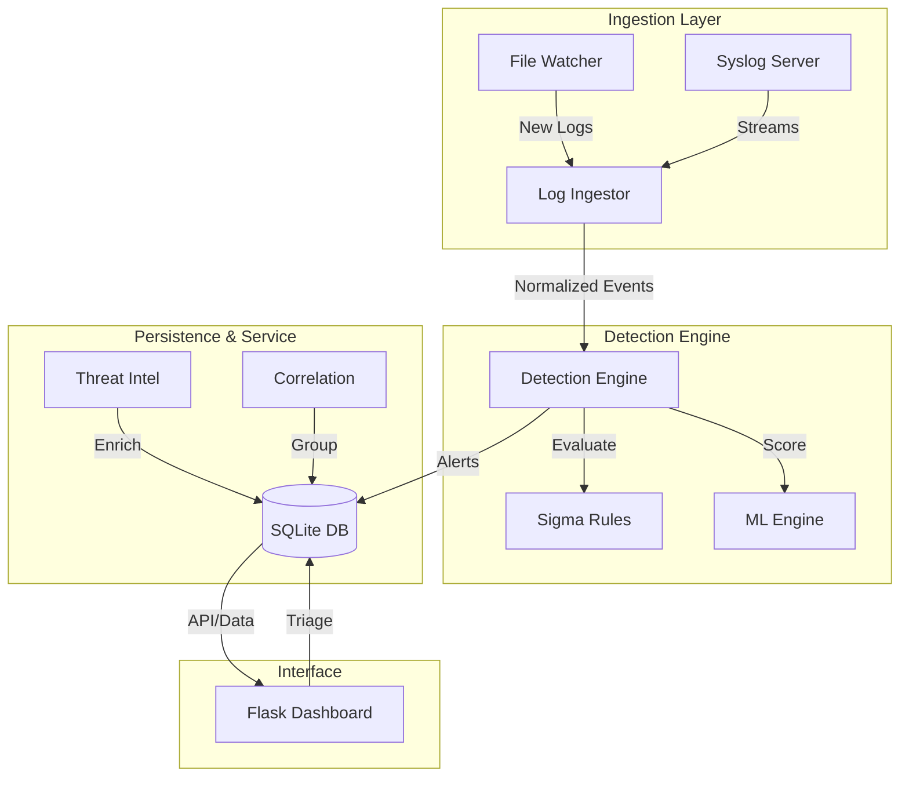

# CyberThreatX (Version 4.0)

[](https://www.python.org/downloads/)
[](https://opensource.org/licenses/MIT)
[]()

**CyberThreatX** is a modern, lightweight SOC-in-a-Box solution designed for real-time threat detection, log ingestion, and alert management. It integrates Sigma rules, machine learning anomaly scoring, and threat intelligence to provide a comprehensive security monitoring platform.

---

## 🚀 Key Features

- 🔍 **Real-time Monitoring**: Watchdog-based file monitoring for EVTX, JSON, and CSV logs.
- 📜 **Sigma Integration**: Native support for Sigma rules with a custom Python-based backend.
- 🧠 **ML Anomaly Detection**: Statistical baselining and Isolation Forest (optional) for behavior analysis.
- 🌐 **Web Dashboard**: Modern Flask interface with alert triage, comments, and correlation views.
- 🔗 **Alert Correlation**: Automated grouping of related alerts (e.g., Brute Force detection).
- 🧬 **Threat Intel**: Automated enrichment with AlienVault OTX and VirusTotal.
- 🔐 **RBAC**: Role-based access control for Analysts and Admins.
- 🐳 **Docker Ready**: Fully containerized for easy deployment.

---

## 🏗️ Architecture



---

## 🛠️ Installation

1. **Clone the repository:**
   ```bash
   git clone https://github.com/AbazarAdam/CyberThreatX.git
   cd CyberThreatX
   ```

2. **Set up virtual environment:**
   ```bash
   python -m venv .venv
   source .venv/bin/activate  # Windows: .venv\Scripts\activate
   ```

3. **Install dependencies:**
   ```bash
   pip install -r requirements.txt
   ```

4. **Initialize Configuration:**
   ```bash
   cp config.example.py config.py
   # Edit config.py with your API keys and paths
   ```

---

## 🖥️ Usage

### 1. Start the Dashboard
```bash
python dashboard.py
```
Access at [http://localhost:5000](http://localhost:5000). Default credentials: `admin` / `changeme`.

### 2. Start the Log Watcher
```bash
python watcher.py --watch-dir monitored_logs
```
Drop any `.evtx`, `.json`, or `.csv` files into `monitored_logs` for real-time processing.

### 3. Run Manual Ingestion
```bash
python detect.py --file samples/security.evtx --db cyberthreatx.db
```

---

## 📂 Project Structure

- `dashboard.py`: Main Flask web interface.
- `detect.py`: Primary detection engine logic.
- `watcher.py`: Real-time file system monitoring.
- `log_ingest.py`: Log normalization and parsing.
- `sigma_backend.py`: Sigma to Python translation logic.
- `ml_engine.py`: Anomaly scoring and baselining.
- `db.py`: Database schema and operations.
- `config.py`: Centralized configuration.

---

## 📖 Documentation

For a detailed breakdown of the project architecture, challenges, and implementation details, see the [FINAL_REPORT.md](CYBERTHREATX_FINAL_REPORT.md).

---

## 📜 License

Distributed under the MIT License. See `LICENSE` for more information.

## 👤 Author

**[Your Name]**
- GitHub: [@AbazarAdam](https://github.com/AbazarAdam)
