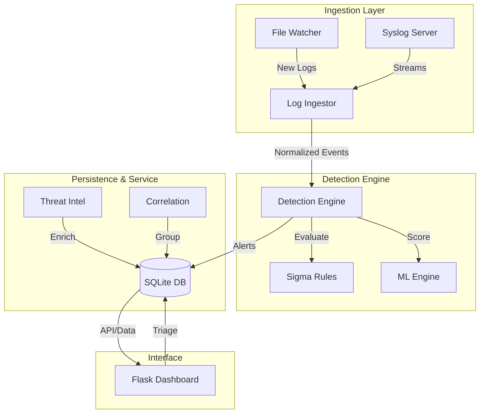

<<<<<<< HEAD
# CyberThreatX (Version 4.0)
=======
# CyberThreatX v1.1
>>>>>>> 0e0b912 (merged origin/main)

[](https://www.python.org/downloads/)
[](https://opensource.org/licenses/MIT)
[]()

**CyberThreatX** is a modern, lightweight SOC-in-a-Box solution designed for real-time threat detection, log ingestion, and alert management. It integrates Sigma rules, machine learning anomaly scoring, and threat intelligence to provide a comprehensive security monitoring platform.

---

## 🚀 Key Features

- 🔍 **Real-time Monitoring**: Watchdog-based file monitoring for EVTX, JSON, and CSV logs, plus optional syslog ingestion.
- 📜 **Sigma Integration**: Native support for Sigma rules with a custom Python-based backend.
- 🧠 **ML Anomaly Detection**: Statistical baselining with optional ML hooks (Isolation Forest scaffolded).
- 🌐 **Web Dashboard**: Modern Flask interface with alert triage, comments, and correlation views.
- 🔗 **Alert Correlation**: Automated grouping of related alerts (e.g., Brute Force detection).
- 🧬 **Threat Intel**: Automated enrichment with AlienVault OTX (VirusTotal scaffolded via config).
- 🔐 **RBAC**: Role-based access control for Analysts and Admins.
- 📊 **Export Capability**: One-click Export to CSV or JSON for external reporting.
- 🐳 **Docker Ready**: Fully containerized for easy deployment.

---

## 🏗️ Architecture


```mermaid
graph TD
    subgraph "Ingestion Layer"
        W[File Watcher] --> |New Logs| P[Log Ingestor]
        S[Syslog Server] --> |Streams| P
    end

    subgraph "Detection Engine"
        P --> |Normalized Events| D[Detection Engine]
        D --> |Evaluate| SIG[Sigma Rules]
        D --> |Score| ML[ML Engine]
    end

    subgraph "Persistence & Service"
        D --> |Alerts| DB[(SQLite DB)]
        TI[Threat Intel] --> |Enrich| DB
        C[Correlation] --> |Group| DB
    end

    subgraph "Interface"
        DB --> |API/Data| UI[Flask Dashboard]
        UI --> |Triage| DB
    end
```

---

## 🛠️ Installation

1. **Clone the repository:**
   ```bash
   git clone https://github.com/AbazarAdam/CyberThreatX.git
   cd CyberThreatX
   ```

<<<<<<< HEAD
2. **Install dependencies:**
=======
2. **Set up virtual environment:**
   ```bash
    python -m venv .venv
    source .venv/bin/activate  # Windows PowerShell: .\.venv\Scripts\Activate.ps1
   ```

3. **Install dependencies:**
>>>>>>> 0e0b912 (merged origin/main)
   ```bash
   pip install -r requirements.txt
   ```

3. **Initialize Configuration:**
   ```bash
<<<<<<< HEAD
   cp config.example.py config.py
   # Edit config.py with your API keys and paths (if needed)
=======
    cp config.example.py config.py  # Windows: copy config.example.py config.py
   # Edit config.py with your API keys and paths
>>>>>>> 0e0b912 (merged origin/main)
   ```

---

## 🖥️ Usage

### 🚀 Unified Launch (Recommended)
The easiest way to start both the dashboard and the log watcher is using the unified script:
```bash
python run_all.py
```
<<<<<<< HEAD
This will launch the dashboard at [http://localhost:5000](http://localhost:5000) and start monitoring the `monitored_logs` directory.

### Manual Launch
If you prefer to run components separately:

1. **Start the Dashboard**: `python dashboard.py`
2. **Start the Log Watcher**: `python watcher.py --watch-dir monitored_logs`

Access at [http://localhost:5000](http://localhost:5000). Default credentials: `admin` / `changeme`.
=======
Access at [http://localhost:5000](http://localhost:5000). Default credentials: `admin` / `changeme` (configurable in config.py).

To enable debug mode during development:
```bash
set CYBERTHREATX_DEBUG=true  # Windows PowerShell: $env:CYBERTHREATX_DEBUG = "true"
```
>>>>>>> 0e0b912 (merged origin/main)

### ⚡ Manual Ingestion
```bash
python detect.py monitored_logs/test.evtx --db cyberthreatx.db
```

---

## 📂 Project Structure

- `dashboard.py`: Main Flask web interface.
- `auth.py`: Authentication and RBAC helpers.
- `detect.py`: Primary detection engine logic.
- `watcher.py`: Real-time file system monitoring.
- `log_ingest.py`: Log normalization and parsing.
- `sigma_loader.py`: Sigma rule loader and metadata extraction.
- `sigma_backend.py`: Sigma to Python translation logic.
- `ml_engine.py`: Anomaly scoring and baselining.
- `db.py`: Database schema and operations.
- `threat_intel.py`: IOC extraction and enrichment.
- `config.py`: Centralized configuration.

---

## 📖 Documentation

For a detailed breakdown of the project architecture, challenges, and implementation details, see [CYBERTHREATX_FINAL_REPORT.md](CYBERTHREATX_FINAL_REPORT.md).

---

## 📜 License

Distributed under the MIT License. See `LICENSE` for more information.

## 👤 Author

**Abazar Adam**
- GitHub: [@AbazarAdam](https://github.com/AbazarAdam)
